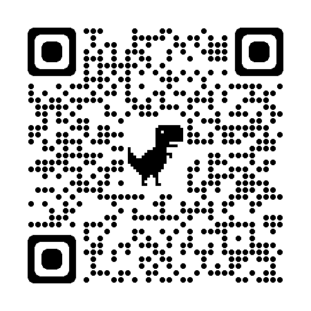

This repository contains material for the "Computational toxicology: Transforming toxicity testing in the 21st century" workshop held during the 2023 ASCEPT Annual Scientific Meeting.

### W106 - Using computers in toxicology education: Python for PK calculations
A. [Single IV](https://colab.research.google.com/github/sladem-tox/PK_calcs/blob/main/PlasmaTime_SingleIV.ipynb)

B. [Single Oral Dose](https://colab.research.google.com/github/sladem-tox/PK_calcs/blob/main/SingleOralDose.ipynb)

C. [IV Infusions](https://colab.research.google.com/github/sladem-tox/PK_calcs/blob/main/Infusion_curves.ipynb)

D. [Non-linear elimination](https://colab.research.google.com/github/sladem-tox/PK_calcs/blob/main/ZeroOrderElimination.ipynb)

E. [Multiple Oral Dose](https://colab.research.google.com/github/sladem-tox/PK_calcs/blob/main/MultipleOralDose.ipynb)

### W107 - Introduction to computational chemistry methods for toxicological modelling
[Google Colab notebook](https://colab.research.google.com/drive/1LQgnHcJouPiH37uUyB9TPRXfn-YHuueC)

### W109 - Machine learning QSAR for toxicity prediction
[Google Colab notebook](https://colab.research.google.com/drive/1MiC7_DwoMslhDn708qJIiV-xYH-3lMfd)

